<h1 align="center">Muhamad Aqil Naufal</h1>

<a href="https://github.com/MAqilNaufal">@MAqilNaufal</a>

System analyst by day, building AI-driven internal tooling and operator systems by night.

  
  

  
  

<!-- assets/info-card.svg is regenerated daily by .github/workflows/update-profile-art.yml
     Run it locally with: python3 tools/render_info_card.py -->
